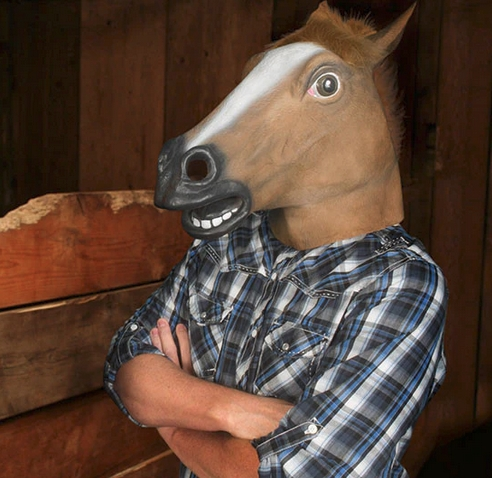

## Modal
Steganographic razzle-dazzle with various types of media and even more various quality of outcome.

### Examples

Image

#### Raw

 

#### Merged

 

#### Deciphered

 
-----

Animation

#### Raw

 

#### Merged

 

#### Deciphered

 

-----

Video

#### Raw

 

#### Merged

 

#### Deciphered

 

